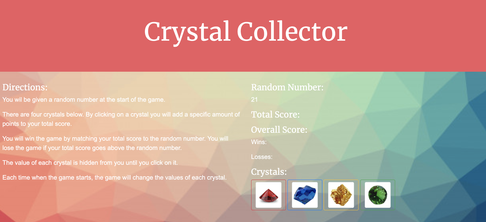

# crystalCollector!

### About this App: 

crystalCollector is a guessing game where the player uses hidden numbers to match a randomly-generated number between 19 and 120.  When the player clicks on one of the crystal buttons, it adds a specific amount of points to the player's total score.  The amount of each crystal is hidden till the player clicks on it.  The amount of each crystal is between 1 and 12 points. 

### How My Game Works:
 
* The player wins the game when his/her total score matches the random number. 
* The player loses the game when his/her total score goes above the random number.
* The number of games won and/or lost are updated and displayed after each game.
* If the player successfully matches his/her total score to the random number, they get one win. If the player's total score is greater than the random number, the player get one loss.  Afterwards, the game restarts.
* When the game is restarted, the player is shown a new random number, each of the crystals have different values, and the player's total score is reseted back to zero.

### Technologies Used for this App:

* Bootstrap, and
* JQuery.

### Thank you for visiting my GitHub!

Enjoy playing my game here: https://lucyq19.github.io/crystalCollector/

If you like this app, you may enjoy using more of my apps here: https://lucyq19.github.io/professionalPortfolio/
